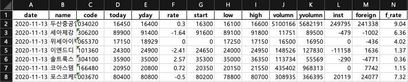
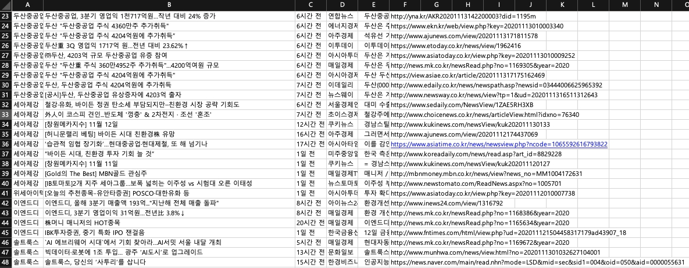
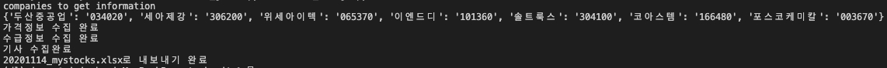

# Stock Investing Management Program
  
by Junmai [github](https://github.com/jonas-jun/stock_management), 2020-11-14
***
Code Description
-----------

### _class stock_inform_
  get stock information: price, volumn, supply and demand, and so on.  
  **[example]** after market on 2020-11-13


  
### _class scrap_news_
  get news information from Naver news. (start date to end date)  
  **[example]** maxpage=30, in late 2days, sorting=1 (from new ones to old ones)
    
    name, title, date, media, summary, link

  
### _def full_run_
  1. debug all process.
  1. make xlsx file.

## How to Run?

companies = ['두산중공업', '세아제강', '위세아이텍', '이엔드디', '솔트룩스']  
full_run(companies=companies, start=20201111, end=20201114, maxpage=3)  
  
**[example]**



```python

```
